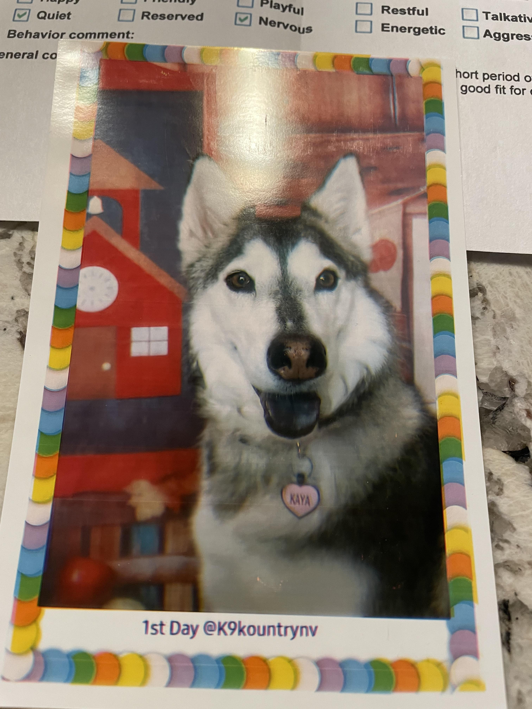

# Very Well Made and Incredible Introduction page

## Table of Contents

1. [Who Am I](https://github.com/AAP127/cse110-lab-reports/blob/main/index.md#who-am-i)
2. [My Programming Experience](https://github.com/AAP127/cse110-lab-reports/blob/main/index.md#my-programming-experience)
3. [A Picture of My Friend's Dog](https://github.com/AAP127/cse110-lab-reports/blob/main/index.md#a-picture-of-my-friends-dog)
4. [Website Requirements](https://github.com/AAP127/cse110-lab-reports/blob/main/index.md#below-is-a-list-of-the-requirements-for-this-website)


## Who Am I
My name is Aatash, and I am the creator of this website. Some of my hobbies including biking and exploring.

### Bike 

[Source](/source/bike.jpg)

* ~~I do not own this bike.~~ ***This is a picture I took of my bike last week.***

### Exploration

[Source](/source/mountain.jpg)

*Exploration can include

* Hiking
* Walking
* Running
* And More!


## My Programming Experience

I have worked with various languages including Python, Java, C/C++, and Arm Assembly.

Some people may claim that

> Assembly is pain and difficult to work with.

While I might agree that it can be difficult to learn, my response to that could be found [here](https://github.com/AAP127/cse110-lab-reports/tree/newbranch#readme).

My favorite example of assembly can be seen below:

```
mov 0, r1
mov 1, r2
mov r2, [r1]
```
(_This will cause a segmentation fault._)


## A Picture of My Friend's Dog
This is a picture of a very good, very happy dog.


[Source](source/best_dog.jpg)


## Below is a list of the requirements for this website:

- [x] Headings
- [x] Styling text
- [x] Quoting text
- [x] Quoting code
- [x] External Links
- [x] Section links
- [x] Relative links 
- [x] Ordered and Unordered Lists
- [x] Task lists